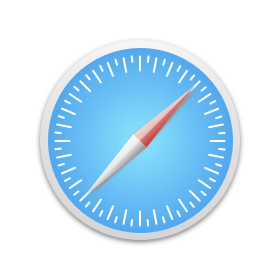

# Jing Sketch XCode

Learn and practice sketch follow 静电's `<Sketch + Xcode 双剑合璧>` video tutorial and book.

## Note

1. [Jing Sketch XCode Note](./note/jing-sketch-xcode-note.md)

## Samples

   

