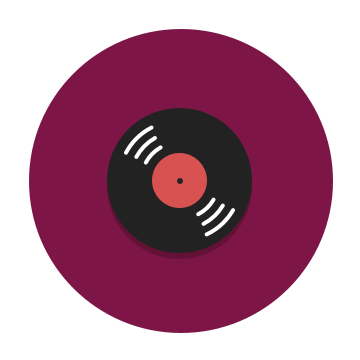

# Jing Sketch XCode Note

Learn and practice sketch follow 静电's `<Sketch + Xcode 双剑合璧>` video tutorial and book.

## References

1. Video: <http://www.sketchchina.com/thread-12.html>
1. Book: `<Sketch + Xcode 双剑合璧>`

## Samples

  

## Note Part 1

Note for video tutorial.

### 三

1. 隐藏显示：左侧图层列表，右侧属性
1. 全屏演示模式

### 四、直线和箭头

直线快捷键：`l`

1. 颜色透明度和图层透明度不一样
1. 收藏颜色到色板
1. 渐变，双击中间增加中间值
1. border
1. shadow

### 五、矩形，三角形，多边形

1. no-zero, even-odd 的区别，用于图形的布尔运算，对应到  Android 中就是 PortBuffXferMode
1. blending 还没讲到
1. fills/border/shadow 没太多可讲
1. joint 用于 border
1. 内发光，有两个 inner shadow 叠加
1. blur：高斯模糊，motion blur, zoom blur, 背景模糊 (即毛玻璃效果，需要将上层图层设置为透明才有效果)

多边形：将多边形的 point 设为 3 就可以得到正三角形。

### 六、布尔运算

1. 四种布尔运算：并集，交集，(减法)，差集(并集减去交集的结果)，交集对应到 Android 的 PortBuffXferMode 就是 `src_in`

   按住 alt 键可以复制拖动图层

   

1. 缩放，旋转，变形

   变形时是对称变形，按住 control 时可以不对称变形

1. 扇形的制作：圆 + 菱形 (正方形的旋转+变形)

   

- `cmd + 1`：中心
- `cmd + 0`：恢复整个页面 100% 缩放
- `ctrl + r`：标尺，在标尺上点击，产生参考线

### 七、钢笔工具 (Vector)

钢笔工具用于绘制 path

最重要：四种锚点方式 (straight, mirror, disconnted, asymmetric)

corners 只针对 straight 方式

round：像素对齐方式，选 none 就行 (View —> Canvas —> Show Pixel ^X) (??)

前面所讲的多边形实际就是有钢笔绘制的

### 八、实战，游戏手柄

最终成果：

快捷键：

1. 组合 `cmd + g`
1. 锁定 `cmd + shift + l`

flatten 的作用：在将多个图层进行布尔运算后，sketch 仍然会保留这些图层，使用 flatten 后，将消除这些图层，将最后的结果合为一个图层。总结就是将多个图层合成为一个图层。

当操作一个底部有其它图层的图层时，最好将底下的图层锁定。

步骤：

1. 先画外部的圆，使用内阴影画出左下角的阴影
1. 开始画手柄，先画左半边，用两个圆和两个矩形，先进行布尔的并集运算，再使用 flatten

   

1. 复制左半部分，并翻转之，成为右半部分，将两者并集并 flatten

   

1. 双击开始使用钢笔工具，删除不需要的节点

   

1. 调整细节

   

1. 复制图层，放到底部，将颜色调为浅绿，作为此手柄的阴影

   

1. 后面的就简单了，十字架和四个按钮，分别是矩形和圆就行，加上没有 blur 的阴影。

最关键就是如何利用布尔运算和钢笔工具。

### 九、实战：唱片图标

快捷键：

1. `alt + shift + 鼠标拖动`：以中心为圆点等比缩放

没有太多难点，主要是同心圆

光泽部分，需要用到辅助三角形，以及剪刀工具

调节阴影的透明度

### 十、文字/字体

没有太多要点

1. fills 的颜色会替代掉 text 的颜色
1. 工具栏的 Font 工具用来帮助选择字体
1. 将文字转成路径，右键选择 Convert to Outlines
1. 将文本附加到路径上，要点：文字图层一定要在路径图层上面

   菜单栏 Type —> Text on Path

1. 网页粘贴文本，去掉格式

   菜单栏 —> Sketch —> Preferences —> Layers  —> Strip Text Style When Pasting

   

### 十一、dartboard

Artboard 的概念，快捷键 a

iPhone 6 的 artboard 尺寸 375x667 是怎么来的? 因为 iPhone 6 的 dpi 是 @2x，iPhone 6 的原始分辨率 750x1330，将其 /2，就得到它的 @1x 分辨率

### 十二、make grid & rotate copy

make grid：快速大量复制粘贴图层

boxed 的用法

rotate copy：用于实现像表盘一样的效果

### 十三、Symbol，共享图层文本样式

Symbol Group，改动一个，所有同时变动。

当其中某一个需要单独设置时，右键 "Detach from Symbol"

共享图层，文本样式，没有太多可讲，就像是 android 中定义的 style。

got!

### 十四、ruler, grid, layout, pixel

工具的使用

ruler：`ctrl + r`，显示标尺。如何删除标尺，拖到左上角。

grid：grid settings…，`ctrl + g`

layout：也有 layout settings…，栅格工具，主要用于设计网页，`ctrl + l`

pixel: 显示像素，放大一个图层，比如 10x，观察边沿，如果开启，边沿会有锯齿。`ctrl + p`

至此，基本上所有的工具都讲完了。

### 十五、基本概念

1. pixel
1. inch, 物理尺寸，比如 5 inch
1. PPI (pixel per inch)
1. DPI (dots per inch)，一般情况下 PPI == DPI
1. dip/dp (device indepened pixel)
   - 160 ppi 时，1dp = 1px，基准
   - 320 ppi 时，1dp = 2px
1. sp (scaled pixel)，用于 android 字体
1. pt (point，磅)，物理单位, 1pt = 1/72 inch，用于 iOS
   - retina, ppi=320, 1pt=2px
   - 非 retina，ppi=160, 1pt=1px

### 十六、artboard 尺寸

一般情况下就用 iPhone6 的一倍尺寸就行了, 375x667 px

### 十七、sketch 插件

1. sketch toolbox，插件管理
1. 插件的几种安装方法

### 十八/十九/二十、常用的 sketch 插件

1. Duplicator

   快速复制元件

1. Content Generator

   generate dummy data

1. Magic Mirror

   - 较少用到，要做宣传画时才会用到，用设计稿放到平面的手机框中。
   - 要点：用钢笔工具在平面的手机框中勾勒出目标图层，名字要与要显示在此处的 Artboard 名字相同

4. Sketch Style Inventory

   !!! 这个对工程师很有帮助啊，自动提取出整个 Page 所用到的所有 color, text style, symbol

5. Material Desigin Color Pallete 

   Hue, Swatch, Value

6. Sketch Notebook

   为设计写批注，为工程师写注意事项!!! 这个有用

7. Sketch Measure

   其中的 "输出规范"，简直就是一个 Zeplin 嘛~!

### 二十一、9 patch 图

没什么可说的。

再次记住，左侧和上侧定义可拉伸的部分，右侧和下侧定义文字区域。

### 二十二/二十三、练习一个邮件 APP

一些快捷键：

1. `cmd + alt + up/down`：把图层上升或下降

从 iOS UI Design 中拷贝别人做好的组件

浅灰：#FAFAFA

### 二十四、在手机上预览

Skala Preview

### 二十五、动起来

1. Principle
1. Pixate
1. Xcode StoryBoard

### 二十六、标注

1. Sketch Measure Plugin

### 二十七、切图与输出

没有太复杂的东西。

iOS 输出时 2倍图加 @2x，3倍图加 @3x
 
切图时要让 sketch measure 隐藏所有标注

切图主要切什么：图标

切片 (slice) 的作用：切图标时，各个图标尺寸不一，这时怎么办，用切片，切出一个统一的尺寸，把图标放置在其中间

切 .9 图：需要拉伸的地方画一个黑点就行了，不用画太长

输出规范：用 sketch measure 就行了。

### 二十八/二十九、问与答

1. 快捷键 0-1-2…9 快速设置透明度，1 表示 10%
1. 属性输入框支持数学运算，137-10 得到 127
1. 快速查看某个组件与其它组件的距离，先选中组件，再按住 alt 键
1. ArtBoard 必须设置了 make exportable 才可以被导出
1. File --> Revert to… 可以进行版本管理

mac 上的历史版本存放在  /.DocumentRevision-V100 中

### 三十、sketch 汉化版

略

### 三十一、最后想说的话

略

## Note Part 2

Note for book.

主要练习了用 StoryBoard 将设计稿进行实现。涉及 StoryBoard, TabBar View Controller, Navigation View Controller.

All Done @2016/2/6.
